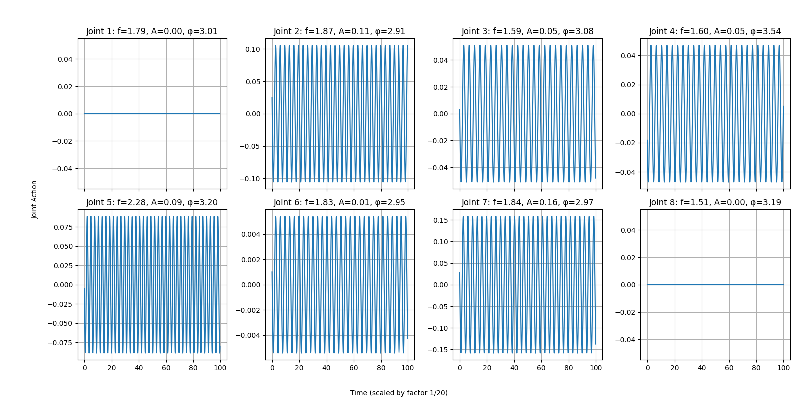
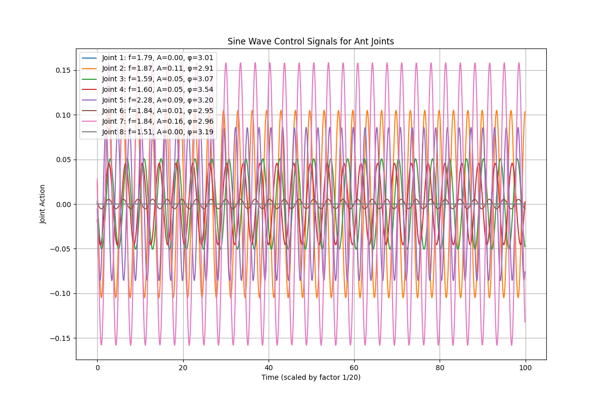

# Ambiente de Execução(Windows):
  Para o ambiente de execução, o PyCharm foi utilizado com a instalação de algumas bibliotecas extras. Para **instalar todas as dependências necessárias**, rode o seguinte comando no terminal:

  `pip install gymnasium[other] mujoco numpy matplotlib moviepy pandas scipy tqdm python-dotenv pyopengl h`
  
  ## Gráficos do melhor indivíduo:

  **Ondas separadas**
  

  **Ondas juntas**
  

  **Vídeo capturado**
  

      
  

